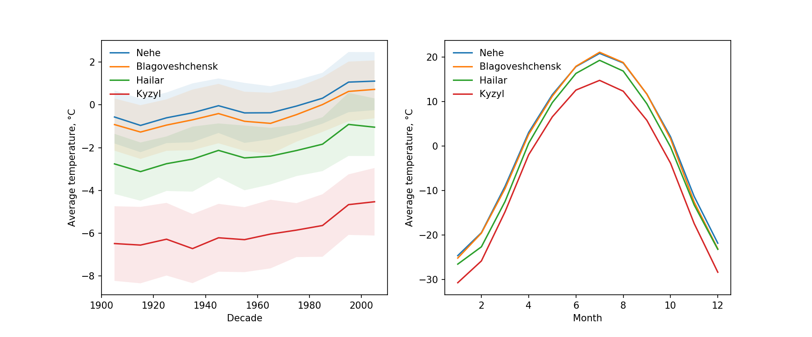
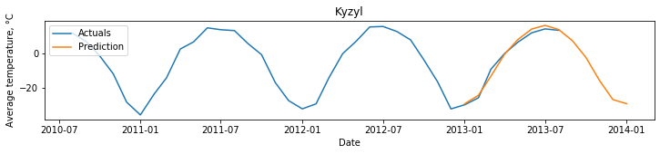
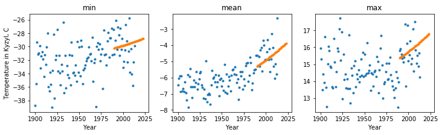
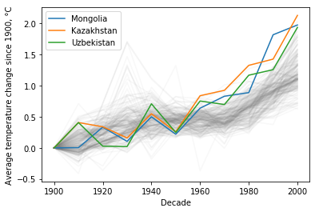

# Climate Kaggle Exercise

Some simple analyses of the Kaggle [Climate Change dataset](https://www.kaggle.com/berkeleyearth/climate-change-earth-surface-temperature-data).

## Content of this repo

1. Jupiter notebooks with code prototypes, exploratory analyses, and descriptions of assumptions and math behind some of the data processing decisions:
   * [0_Preliminary_exploration.ipynb](0_Preliminary_exploration.ipynb) - preliminary exploration of the data, tests of data availability
   * [1_countries.ipynb](1_countries.ipynb) - identifying (and visualizing) countries with most severe overall temperature change (see the notebook for more comments, and a list of assumptions)
   * [2_top_variability_cities.ipynb](2_top_variability_cities.ipynb) - identifying and visualizing cities with highest temperature variability
   * [3_prediction.ipynb](3_prediction.ipynb) - prototyping a predictive model for monthly temperatures
2. Deployable version:
   * [my_climate.py](my_climate.py) - a package of methods, based on those prototypes in the notebooks, but improved
   * [4_final_testbed.ipynb](4_final_testbed.ipynb) - a testing bed notebook to demo the package

Also, here is the output of the city temperature variability analysis. In the left panel, colored bands around each line show the 95% confidence interval (uncertainty) of mean temperatures, after seasonality is removed. The right panel show the seasonality patterns for same 4 cities. Note that nominally the first 4 "most variable" cities included two locations that are nominally different cities, but are located so close to each other that are served by the same weather tracking station (e.g. Blagoveshchensk and Heihe). So the figure below shows 4 _different_ cities with highest overall month-to-month temperature variability.

## General comments and additional info

### Techstack choice

numpy, pandas, and matplotlib were the obvious choices for this analysis. For the predictive model, I briefly considered using something a bit fancier (Tensorflow?), but opted for a simple choice (`sklearn.linear_model.LinearRegression`). Our biggest concerns for this task is not about the expressivity of the model, but about the assumptions behind it (see below), and an additive multilinear model should be flexible enough to build a reasonable solution.

### How to run and test it locally

I never worked with containerization before, and while I know the theory behind it, I thought it would a bit risky to try it for this project. But as I only used reasonably standard Python packages, I hope this code will work as is.

Dependencies:

* Python 3.7.6
* `numpy`, `pandas`, `matplotlib`
* `scipy.stats`
* `sklearn.linear_model`

The only environmental variable critical for Jupyter notebooks is the `folder_name` global string variable, which is set in the 2nd cell of each notebook. It should contain a path leading to the folder with 2 data files: `GlobalLandTemperaturesByCountry.csv` and `GlobalLandTemperaturesByCity.csv`.

For the `my_climate.py` package, the same path needs to be passed to the `.read_data()` method as an argument (see [4_final_testbed.ipynb](4_final_testbed.ipynb) for a use case).

### Predictive model description, and possible next steps

For temperature prediction, I used a simple additive linear model with a fixed yearly cycle (linearly fit to the data), and a quadratic overall temperature trend superimposed onto this yearly cycle: $t(\text{date}) = t_m(\text{month}) + a\cdot \text{year}^2 + b \cdot \text{year} + c$.  This model worked reasonably well, both at the monthly level:

and at a long-term yearly-to-decade level, in terms of average, min, and max temperatures at each city:

Model limitations, comments on pre-processing, and possible next steps:

* If you look at the shape of climate change in recent decades, you can see that the overall trend in 20th to early 21st century was not linear, but is also not quite quadratic. For the majority of countries (shown in gray below) the temperature increased a bit, then platoed for a few decades, and then jumped up with a sharp inflection around 1970s. This means that our quadratic model could underestimate average yearly temperatures at a short horizon (as a parabola changes more slowly), but overestimate climate change in the long-term (as polynomial fits explode at infinity). A smart solution here would be to use a family of models that is more representative of domain-specific models used in climate studies. The "good" news here is that for Mongolia (and thus for Northern China and Eastern Russia) the curves are a bit more parabolic, and so the fit should be better.

* I used a global model that fit the entire time range, and did not pay more attention to the few months immediately before the actuals ended, and the prediction period started. Because of that , for some cities it had **a discontinuity around 2013-01-01**, with temperatures jumping from the actual for December 2012 to a very different value for January 2013. A smarter model would have gradually eased the data from locally fit to globally fit over a course of 1 year or so.
* Due to the nature of the problem, it is **hard to define the test accuracy of this model**. We can look at the overall accuracy for the first few months of 2013 that are available for some cities, but we cannot easily test this model on past data, as the recent acceleration of climate change looks unique, and nothing like this rapid acceleration is available in the past data. (There is this interesting peak in the 1930s, which is apparently called the Greenland Warming of the 1930s, but it looks very different from what is happening now. Reference: Chylek, P., Dubey, M. K., & Lesins, G. (2006). Greenland warming of 1920–1930 and 1995–2005. Geophysical Research Letters, 33(11). )
* My model assumes that with time, only the average temperature will change, while the shape of the yearly cycle of temperatures within each location (the seasonality) will remain the same. This is probably untrue, as the re-distribution of air flows, changes in albedo in the mountains, and changes in precipitation, **would also change the seasonal cycle**, potentially with some locations becoming even more continental (large summer-to-winter swing), and some becoming more mild. Other non-obvious effects are possible too, so maybe for some locations the entire "sine wave" of seasons will become more "squarish", or more "triangular", or will slightly change its phase. Conceivably, we could try to fit it, for example, by fitting the progression of average temperatures for each month independently. This could capture the change in the seasonality cycle, but unless we also regularize this model, by introducing a reasonable continuity constraint, the estimations for individual months would quickly diverge, as we project in the future. Still, it's a valid direction for a more careful model-building.
* For **data pre-processing**, I limited the range of historical data used in the model by 20th century + first 12 years of 21st century. The logic here is that, at one hand, older data doesn't show that rapid climate change that we've seen in 20th and 21st centuries, so it is not that relevant for fitting the long-term trend. And at the other hand, for the seasonal cycle of temperature changes, 100+ points is more than enough to build a reasonable estimation of its typical yearly shape. An awkward side-effect of this assumption though, is that I didn't have to deal with missing data, which somewhat contradicts the spirit of this assignment, as I comment below.
* **Other data that could be used**: obviously, we could use the location of each city to add a spatial aspect to this model. We could also plug in some info on CO2 releases, and some reasonable projections for CO2 releases (or its eventual sequestration) in the future. But the most important "outside data" we could use, as described above, would be the family of reasonable mathematical curves to fit each individual city.

### Time count and challenges

It took me about 8 hours overall to code this, spread across the entire week (I use [clockify.me](http://clockify.me) to track time), and then about an hour more to write this report. This may sound like a lot, but I never before worked with climate data, data with seasonal variation, or this particular type of date-time transformations in Pandas. So I took my time, did some research, and also documented everything that I learned in my [Zettelkasten system](https://github.com/khakhalin/notes). I also wasted several hours fighting with AverageTemperatureVariability values, trying to figure out whether I can estimate the within-month temperature swings from it. Most of this work was a dead-end, and didn't make it into the final report.

The biggest challenge with this data, at least at the level at which I had time to engage with it, was not technical, but rather "role-playing", if you will. For example, I am expected to write production-quality code, which implies that I am probably expected to code some data validity checks, and some automated data cleaning. But what cold be the real use case here? All missing data in this dataset happens before 1950 for countries, and before 1900 for cities. On the other hand, temperature prediction usually happens into the future, and at least for naive extrapolation methods, the last 50 years of data may be enough to make a reasonable prediction. Does it mean that I can just consider a range of reasonable dates, and not check data for validity? Is it OK if I don't impute missing points to reduce bias for those years where one or two observations are missing? These are the questions where I had to use my judgment. In practice, I decided to only consider dates between 1900 and 2013, but also drop `na` values just in case, but I wonder if it was a reasonable assumption.
